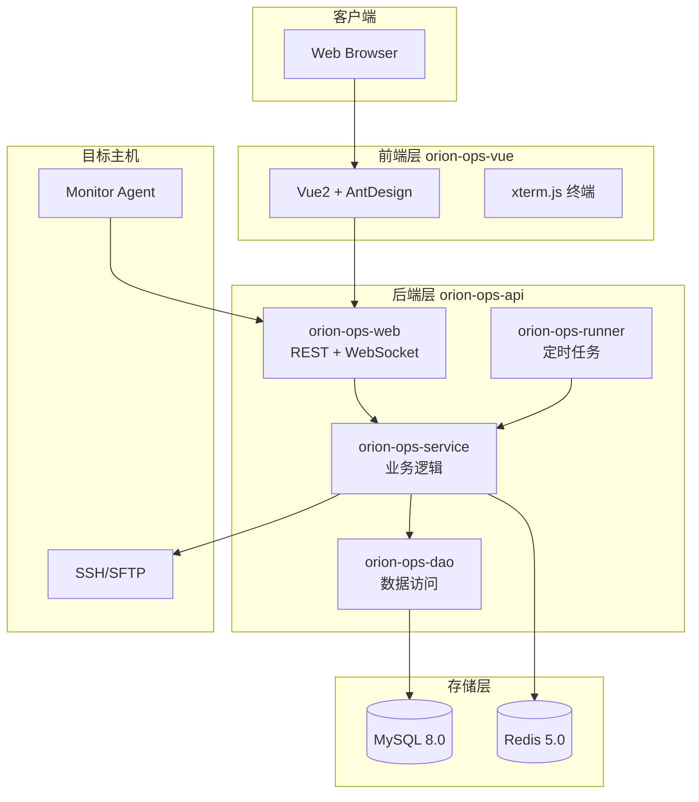

<div align="center">

# orion-visor

**一站式智能运维平台 · 轻量堡垒机 · 安全审计 · CI/CD 自动化**

[](LICENSE)
[](https://spring.io/projects/spring-boot)
[](https://vuejs.org/)
[](https://www.mysql.com/)

[功能特性](#功能特性) · [技术栈](#技术栈) · [架构设计](#架构设计) · [快速开始](#快速开始) · [功能模块](#功能模块)

</div>

---

## 项目简介

**orion-visor** 是一款面向企业的智能运维平台，集成机器管理、监控告警、Web 堡垒机、操作审计、文件管理、批量运维、定时调度与 CI/CD 流水线于一体。采用多环境隔离设计，支持 Docker 一键部署，帮助企业实现轻量化、合规化的运维治理。

> 仓库地址：[https://github.com/liubowen-dev/orion-visor](https://github.com/liubowen-dev/orion-visor)

---

## 功能特性

| 模块 | 能力 |
|------|------|
| 机器管理 | 主机 CRUD、分组、SSH 密钥、代理配置 |
| 监控告警 | Agent 采集、指标监控、钉钉/Webhook 告警 |
| Web 堡垒机 | 在线 SSH 终端、录屏回放、会话监视、强制下线 |
| 安全审计 | 操作日志、登录日志、终端会话审计 |
| 文件管理 | WebSFTP、断点续传、批量上传下载 |
| 批量运维 | 批量命令执行、命令模板、执行日志 |
| 定时调度 | Cron 表达式、调度记录、执行统计 |
| 多环境隔离 | 应用 Profile、环境变量占位符替换 |
| CI/CD | 构建任务、发布任务、流水线编排 |

---

## 技术栈

### 后端
- Java 8 · Spring Boot 2.4+
- MyBatis-Plus 3.4 · MySQL 8.0 · Redis 5.0
- WebSocket · SSH/SFTP · Swagger/Knife4j

### 前端
- Vue 2.6 · Ant Design Vue 1.7
- xterm.js · ECharts · Axios

### 部署
- Docker · Docker Compose · Nginx

---

## 架构设计



### 模块结构

```
orion-visor/
├── orion-ops-api/              # 后端 Maven 多模块
│   ├── orion-ops-common/       # 公共工具、常量、异常
│   ├── orion-ops-model/        # 实体、VO、DTO
│   ├── orion-ops-dao/          # MyBatis Mapper
│   ├── orion-ops-mapping/      # 对象映射
│   ├── orion-ops-data/         # 数据权限、缓存
│   ├── orion-ops-service/      # 核心业务逻辑
│   ├── orion-ops-web/          # REST API + WebSocket
│   └── orion-ops-runner/       # 启动后定时 Runner
├── orion-ops-vue/              # Vue2 前端
├── docker/                     # Docker 镜像构建
├── sql/                        # 数据库初始化脚本
└── docs/                       # 项目文档
```

---

## 快速开始

### 环境要求

- JDK 1.8+
- Maven 3.6+
- Node.js 14+ / npm 6+
- MySQL 8.0 · Redis 5.0
- Docker 20+（推荐）

### Docker 部署（推荐）

```bash
git clone https://github.com/liubowen-dev/orion-visor.git
cd orion-visor
docker-compose up -d
```

访问：`http://localhost:1080`  
默认账号：`orionadmin` / `orionadmin`

### 本地开发

```bash
# 1. 初始化数据库
mysql -u root -p < sql/init-1-schema.sql
mysql -u root -p < sql/init-2-data.sql

# 2. 启动后端
cd orion-ops-api
mvn clean package -DskipTests
java -jar orion-ops-web/target/orion-ops-web.jar

# 3. 启动前端
cd orion-ops-vue
npm install
npm run serve
```

---

## 功能模块

### 控制台 & 机器管理


### Web 堡垒机 & 录屏审计


### 监控告警


### CI/CD 流水线


---

## 版本迭代记录

| 版本 | 批次 | 说明 |
|------|------|------|
| v0.1.0-init | Batch-1 | 项目初始化、基础框架 |
| v0.2.0-machine | Batch-2 | 机器管理、监控告警 |
| v0.3.0-bastion | Batch-3 | Web 堡垒机、审计 |
| v0.4.0-ops | Batch-4 | 文件管理、批量运维、调度 |
| v0.5.0-cicd | Batch-5 | 多环境、CI/CD 流水线 |
| v1.0.0 | Batch-6 | 文档完善、正式开源 |

---

## 贡献指南

1. Fork 本仓库
2. 创建特性分支：`git checkout -b feat/your-feature`
3. 提交变更：`git commit -m "feat(scope): description"`
4. 推送并发起 Pull Request

---

## 免责声明

使用前请阅读 [DISCLAIMER.md](DISCLAIMER.md)。

---

## License

[Apache License 2.0](LICENSE)
